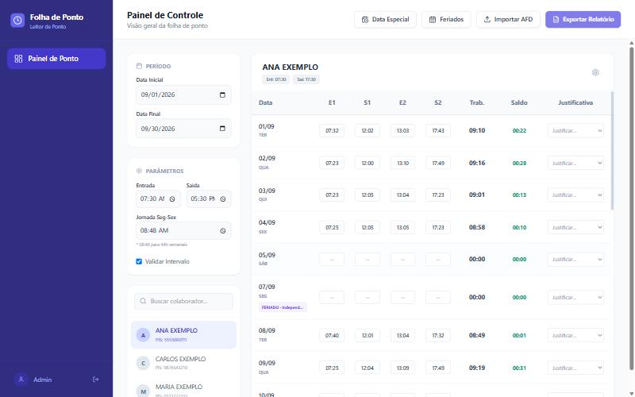

# Leitor de Folha de Ponto

> Aplicativo de desktop para Windows que lê o arquivo **AFD** gerado pelo relógio de ponto (REP), calcula horas trabalhadas, atrasos e **banco de horas** e exporta a folha de cada funcionário para Excel.




*Imagem gerada com dados fictícios.*

---

## Sobre o projeto

O projeto nasceu de uma necessidade real: o relógio de ponto de uma loja familiar gera um arquivo `.txt` que ninguém consegue ler direto. Conferir batida por batida e fechar o banco de horas à mão toda semana dá trabalho e erro.

O Leitor de Folha de Ponto resolve isso: basta **importar o arquivo do relógio**, escolher o **período** e ver, para cada funcionário, as batidas, o total trabalhado e o saldo de cada dia. Faltas de batida, almoço não registrado e atrasos aparecem destacados, e tudo pode ser corrigido na própria tela e exportado em planilha.

Funciona **100% offline**: nenhum dado sai do computador.

## Funcionalidades

| Recurso | O que faz |
|---|---|
| **Importação de AFD** | Lê arquivos `.txt` / `.rep` do relógio, identifica funcionários e batidas e agrupa pessoas que aparecem com mais de um PIS. |
| **Banco de horas (44h semanais)** | Seg–Sex com jornada configurável (padrão 08:48); sábado, domingo e feriado não têm jornada, então tudo que for trabalhado vira saldo positivo. |
| **Detecção de inconsistências** | Batida ímpar (falta saída), falta integral e intervalo de almoço não registrado. |
| **Edição manual de horários** | Corrige ou adiciona batidas direto na tabela. As edições ficam separadas das batidas originais e podem ser desfeitas com **"restaurar"**. |
| **Datas especiais** | Muda entrada, saída e jornada de um dia para **todos** os funcionários ou só para **um**, por exemplo véspera de feriado com expediente reduzido. |
| **Feriados** | Feriados nacionais calculados automaticamente (inclusive Sexta-feira Santa, via data da Páscoa), com opção de desativar e de cadastrar feriados municipais ou pontos facultativos. |
| **Justificativas** | Atestado Médico, Consulta Médica, Férias e Folga abonam o dia; **Banco de Horas** debita a jornada do saldo sem acusar falta. |
| **Ajuste individual** | Entrada, saída, jornada e validação de almoço específicos por funcionário. |
| **Exportação para Excel** | Planilha com **Resumo Geral** e uma aba de folha de ponto por funcionário. |
| **Salvamento automático** | Configurações, justificativas, edições, feriados e período são guardados no computador e voltam ao reabrir o app. |
| **Aplicativo instalável** | Instalador `.exe` para Windows com atalho na Área de Trabalho. |

## Regras de cálculo

- **Saldo do dia** = tempo trabalhado − jornada esperada. Cada minuto conta para o banco de horas.
- **Tolerância de 10 min:** diferenças menores que isso não são marcadas como atraso nem como hora extra na visualização diária.
- **Batidas** são ordenadas por horário e pareadas em entrada/saída (E1–S1, E2–S2).
- **Domingos** não aparecem na folha.
- **Dia abonado** (atestado, férias, folga): saldo zerado e batidas bloqueadas.
- **Prioridade da configuração de um dia:** data especial individual → data especial geral → ajuste individual do funcionário → configuração global.

## Tecnologias

- **React 18 + TypeScript** — interface e tipagem.
- **Vite** — build e servidor de desenvolvimento.
- **Tailwind CSS** — estilização.
- **Lucide React** — ícones.
- **SheetJS (xlsx)** — geração das planilhas.
- **Electron + electron-builder** — empacotamento como aplicativo Windows.
- **Parser próprio (regex)** para o layout do AFD, em [`parser.ts`](parser.ts).

## Estrutura

```
├── index.tsx          # Interface e estado da aplicação
├── parser.ts          # Parser do AFD e cálculo de horas / banco de horas
├── feriados.ts        # Feriados nacionais (inclui cálculo da Páscoa)
├── types.ts           # Tipos compartilhados
├── electron/main.cjs  # Janela do aplicativo desktop
└── docs/              # Imagens do README
```

## Como usar

1. Abra o app e clique em **Importar AFD**, escolhendo o arquivo do relógio.
2. Defina a **Data Inicial** e a **Data Final**.
3. Escolha o funcionário na lista e confira a folha.
4. Se precisar, corrija horários, escolha uma **justificativa** ou cadastre uma **Data Especial** ou um **Feriado**.
5. Clique em **Exportar Relatório** para gerar o Excel.

Configuração padrão: entrada **07:30**, saída **17:30**, almoço **12:00–13:00**, jornada **08:48**, tolerância **10 min**. Tudo pode ser alterado no painel **Parâmetros**.

## Rodando o projeto

Requisitos: [Node.js](https://nodejs.org/) 18 ou superior.

```bash
npm install
npm run dev     # abre no navegador em http://localhost:3000
npm run app     # compila e abre como aplicativo desktop (Electron)
npm run dist    # gera o instalador Windows em release/
```

> Se `npm run dist` falhar com `EPERM` ao gravar dentro de `Desktop` ou outra pasta sincronizada, gere em outra pasta:
> `npx electron-builder --win nsis -c.directories.output=C:/temp/lfp-release`

## Ideias futuras

- Exportar a folha em PDF, pronta para imprimir e assinar.
- Mostrar linhas do AFD que não puderam ser lidas.
- Importar vários arquivos AFD e juntar os meses sem duplicar batidas.
- Resumo do período com atrasos, faltas e saldo por pessoa.
- Adicional de horas extras (50% / 100%).

## Licença

Projeto de uso pessoal e de portfólio.

---

Desenvolvido por **Theo Hideki**.
